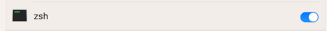

# THE PROBLEM:


Not only is it slow, when the mouse cursor happens to be in the center of the screen, you might end up selecting the wrong language!<br>
# THE SOLUTION (get rid of the pop up):
We're going to set up a process that runs on startup, intercepts the `fn` key and fulfills exactly the same action - except without the annoying pop-up.
1. (Ventura) Go to System Settings -> Keyboard -> set this to "Do Nothing"

2. Install [issw](https://github.com/vovkasm/input-source-switcher), a small utility for macOS to switch input sources from the command line. By default, the program will be installed as `/usr/local/bin/issw`.<br>
(you may need to `brew install cmake` if you haven't already)
```shell
    git clone https://github.com/norflin321/input-source-switcher.git
    cd input-source-switcher
    mkdir build && cd build
    cmake ..
    make
    make install
```
3. Download [fn.py](raw/main/fn.py) and [fn.plist](raw/main/fn.plist) (right click -> save as). Place them both in your `Downloads` folder.
4. Allow `zsh` to monitor and modify your keyboard input:
   1. Go to System Settings -> Privacy & Security -> Accessibility -> `+` -> type CMD+SHIFT+G
   2. In the little text box, paste `/bin/zsh`.
   3. Mark it as active: 
5. Copy the plist file (service specification) and the python script to launchctl:<br>
   1. `mkdir ~/Library/LaunchAgents/fn_lang_switcher`
   2. `cp ~/Downloads/fn.plist ~/Downloads/fn.py ~/Library/LaunchAgents/fn_lang_switcher/`
6. Set the process to load on system startup: `launchctl load -w ~/Library/LaunchAgents/fn_lang_switcher/fn.plist`<br>
To stop it at a future date, run `launchctl unload -w ~/Library/LaunchAgents/fn_lang_switcher/fn.plist`

# RESULT:
You can toggle input source with "fn" button, but without showing the pop up!
